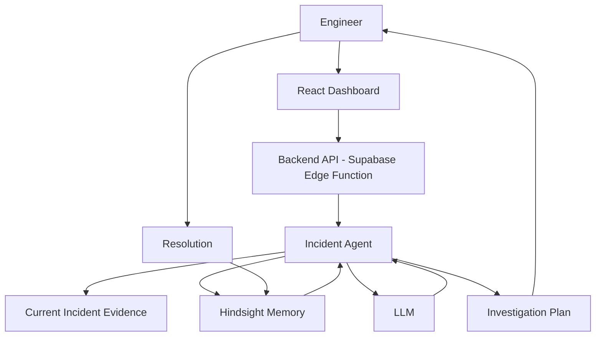

# RecallOps

## AI Incident Response Agent with Persistent Organizational Memory

RecallOps is an AI-powered incident response assistant for DevOps/SRE teams. It uses **Hindsight by Vectorize** as persistent organizational memory to recall past incident experience and produce increasingly specific investigations over time.

### The Problem

When a production incident happens, engineers waste time searching through previous incident tickets, postmortems, logs, runbooks, and troubleshooting notes. Knowledge gained from resolving one incident rarely transfers to the next.

### The Solution

RecallOps remembers. For every new incident, it:

1. Recalls similar previous incidents from Hindsight memory
2. Passes that experience to an LLM alongside current evidence
3. Generates a specific, memory-informed investigation plan
4. Stores new resolutions back into Hindsight for future recall

### Why Persistent Memory?

A stateless AI gives generic advice: "Check your database." An AI with organizational memory says: "I found two previous incidents involving this service. One had the same database connection exhaustion pattern. The previous team tried restarting the service, which only temporarily helped. The successful resolution was correcting the connection-pool configuration."

That difference is the entire point of this project.

### Why Hindsight?

Hindsight by Vectorize is a purpose-built memory layer for AI agents. It provides:

- **Retain** — Store memories with automatic fact extraction
- **Recall** — Semantic similarity search with spreading activation
- **Reflect** — Synthesize new knowledge from existing memories
- **Entity resolution** — Link related concepts across memories
- **Observation consolidation** — Automatically synthesize patterns

RecallOps uses Hindsight's REST API (`POST /v1/default/banks/{bank_id}/memories` for retain, `POST /v1/default/banks/{bank_id}/memories/recall` for recall) to maintain organizational experience.

## Architecture



### Memory Architecture

RecallOps uses three conceptual memory types, all stored in Hindsight:

**Episodic Memory** — Specific previous incidents (INC-1001, payment-service, database connection pool exhaustion, root cause, fix, lessons learned).

**Procedural Memory** — How incidents should be investigated (for payment-service database failures: check pool usage, compare config, inspect active connections).

**Organizational Knowledge** — Patterns learned across incidents (payment-service database failures frequently occur after configuration changes affecting connection pools).

Hindsight automatically handles fact extraction, entity linking, and observation consolidation — so these memory types emerge from storing incident resolutions, not from manual categorization.

## Tech Stack

- **Frontend**: React, TypeScript, Vite, Tailwind CSS, Lucide icons
- **Backend**: Supabase Edge Functions (Deno runtime)
- **Database**: Supabase (PostgreSQL)
- **AI**: OpenAI-compatible LLM API (Groq recommended)
- **Memory**: Hindsight by Vectorize

## Setup

### Prerequisites

1. A Supabase project (auto-provisioned in Bolt)
2. An LLM API key (Groq or OpenAI-compatible)
3. A Hindsight instance (self-hosted or Hindsight Cloud)

### Installation

```bash
npm install
```

### Environment Variables

Copy `.env.example` to `.env` and fill in your credentials:

```env
LLM_API_KEY=your-groq-or-openai-api-key
LLM_BASE_URL=https://api.groq.com/openai/v1
LLM_MODEL=llama-3.3-70b-versatile

HINDSIGHT_BASE_URL=https://your-hindsight-instance
HINDSIGHT_API_KEY=your-hindsight-auth-key
HINDSIGHT_BANK_ID=recallops-incident-memory
```

Supabase credentials (`VITE_SUPABASE_URL`, `VITE_SUPABASE_ANON_KEY`) are auto-configured in the Bolt environment.

**Alternatively**, you can configure credentials through the in-app Settings page — they are stored in the Supabase database and used by the edge function.

### Running Locally

```bash
npm run dev
```

The app runs on `http://localhost:5173`.

## Demo

The ideal demo flow:

```
1. Open the app → Dashboard
2. Click "Seed Demo Data" → Creates 9 historical incidents + stores in Hindsight
3. Click "Load Similar Incident" → Creates INC-1042 (payment-service DB pool exhaustion)
4. Open the incident → Click "Analyze Incident"
5. Watch the loading steps: Analyzing → Searching memory → Comparing → Generating
6. See the AI recall INC-1001 from Hindsight and generate a specific investigation
7. Click "Resolve Incident" → Fill in resolution → "Save Resolution & Learn"
8. Memory is stored in Hindsight
9. Load another similar incident → See both experiences recalled
```

### Demo Data

The "Seed Demo Data" button creates 9 realistic historical incidents:

| # | Service | Incident |
|---|---------|----------|
| 1 | payment-service | Database connection pool exhaustion |
| 2 | payment-service | Third-party payment API timeout |
| 3 | auth-service | Redis cache failure |
| 4 | auth-service | Token validation latency after JWT key rotation |
| 5 | order-service | Database replication lag |
| 6 | order-service | API latency spike from N+1 query regression |
| 7 | notification-service | Third-party rate limiting |
| 8 | infrastructure | Kubernetes CrashLoopBackOff (OOMKilled) |
| 9 | infrastructure | Container memory exhaustion |

Each includes realistic logs, symptoms, root causes, failed attempts, successful fixes, and lessons learned.

## API Design

All backend logic runs in a single Supabase Edge Function (`recallops-api`):

| Method | Endpoint | Description |
|--------|----------|-------------|
| GET | `/api/health` | Health check |
| GET | `/api/incidents` | List incidents (optional `?status=` filter) |
| GET | `/api/incidents/:id` | Get single incident |
| POST | `/api/incidents` | Create new incident |
| POST | `/api/incidents/:id/analyze` | AI analysis with Hindsight recall |
| POST | `/api/incidents/:id/resolve` | Record resolution + store in Hindsight |
| POST | `/api/demo/seed` | Seed demo data into Hindsight |
| POST | `/api/demo/load-similar` | Load demo incident for testing |
| GET | `/api/memory/status` | Hindsight connection status |
| GET | `/api/settings` | Get settings (keys masked) |
| PUT | `/api/settings` | Update settings |

## Testing

```bash
npm run typecheck   # TypeScript type checking
npm run build       # Production build verification
npm run lint        # ESLint
```

## Limitations

- **No authentication**: This is a demo MVP. In production, add Supabase auth and scope incidents per user/team.
- **Settings stored in database**: API keys are stored in the `app_settings` table. In production, use Supabase secrets or a vault.
- **No automatic remediation**: RecallOps only recommends actions — the engineer decides what to execute.
- **Single Hindsight bank**: All incidents share one memory bank. Multi-tenant would use per-org banks.

## Future Improvements

- Real-time incident alerts via Supabase Realtime
- Slack/PagerDuty integration for incident creation
- Postmortem auto-generation from resolution data
- Procedural memory extraction using Hindsight's reflect endpoint
- Multi-team support with scoped memory banks
- Incident similarity scoring and duplicate detection
- Runbook linking from recalled memories

## Hackathon Criteria

### Innovation (30%)
RecallOps applies AI agent memory to incident response — a domain where institutional knowledge is routinely lost. The learning loop (incident → resolve → store → recall → better investigation) is a novel application of Hindsight.

### Use of Hindsight Memory (25%)
Hindsight is the core of the application. Every analysis queries Hindsight for recall. Every resolution is stored via retain. The before/after memory impact is demonstrated explicitly on the dashboard.

### Technical Implementation (20%)
Full-stack: React frontend, Supabase Edge Function backend (Deno), PostgreSQL database, Hindsight REST API integration, OpenAI-compatible LLM with structured JSON output, incident normalization, and a complete learning loop.

### User Experience (15%)
Professional SRE/DevOps dashboard with sidebar navigation, loading states that show the agent workflow, structured analysis output, and clear separation of facts vs inference.

### Real-world Impact (10%)
Incident response time is a real cost. Organizations lose institutional knowledge when engineers leave. RecallOps captures and reuses that knowledge, directly reducing mean-time-to-resolution.
